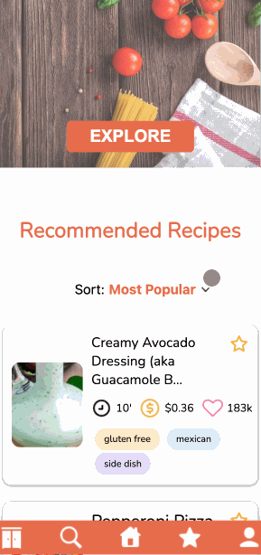

</img>

## Project Overview
(Description)

| [Demo](#demo) |
| [Module Detail](#module-detail) |
| [Technologies](#technologies) |
| [Getting Started](#getting-started) |

#### **Team Curtain's Full-Stack Project Members**

<table align="center">
    <th colspan="6">Team Members</th>
  <tr>
      <td width="100px" align="center"><a href="https://github.com/asieke"><b>Alex Sieke</b></a> </td>
      <td width="100px" align="center"><a href="https://github.com/Heine574"><b>Johannes Niemelä</b></a </td>
      <td width="100px" align="center"><a href="https://github.com/FullStackEidolon"><b>Ian McGahren</b></a> </td>
      <td width="100px" align="center"><a href="https://github.com/lbc1013"><b>ByungChan Lee</b></a> </td>
      <td width="100px" align="center"><a href="https://github.com/leonardodeutsch"><b>Leonardo Deutsch</b></a> </td>
      <td width="100px" align="center"><a href="https://github.com/winstonthep"><b>Winston Pantelakos</b></a> </td>
  </tr>
</table>

*Our project management / ticketing system : <a href='https://trello.com/b/z8nnOpaT/project-gordon-web'>https://trello.com/b/z8nnOpaT/project-gordon-web</a>

## Demo
##### 1. Website View

##### 2. Mobile View

## Module Detail
### 1. Authentication and Profile

- Users are able to sign up to create a profile or sign into an existing profile from a sign in modal. User emails are validated in this modal with native HTML email validation.
- Upon signing in, user information populates all aspects of the app. Users are then able to access their favorited recipes and pantry items, which persist across login sessions.

### 2. Search View & Result View

(Description)

### 3. Home View & Favorite View

- Display the main homepage image that gets changed everytime the user enters.
- List out the Recommend Recipes for the guest and provide the sort options such as the most popular, price:high-low, price:low-high.
- For the favorite View, display the Favorited Recipes list for the logged-in user.

### 4. Solo Recipe View & Recipe Tile

- Reusable Recipe Tile component used in different components throughout the app, also dynamic in size and information based on platform (desktop/mobile).
- Solo Recipe View with more detailed information of a specific recipe, including a dynamic ingredient list that shows the user which ingredients they currently have in their pantry based on the user's input.
- Liking and Favoriting functionality in both tiles and full recipe view which persist through user logins.

### 5. Pantry Chef api
https://github.com/hack-curtains/project-gordon-api

## Technologies

####  &nbsp;&nbsp;&nbsp;&nbsp;&nbsp;&nbsp;&nbsp;&nbsp;&nbsp;&nbsp;&nbsp;&nbsp;  
####  &nbsp;&nbsp;&nbsp;&nbsp;&nbsp;&nbsp;&nbsp;&nbsp;&nbsp;&nbsp;&nbsp;&nbsp;     
####  &nbsp;&nbsp;&nbsp;&nbsp;&nbsp;&nbsp;&nbsp;&nbsp;&nbsp;&nbsp;&nbsp;&nbsp;  
####   &nbsp;&nbsp;&nbsp;&nbsp;&nbsp;&nbsp;&nbsp;&nbsp;&nbsp;&nbsp;&nbsp;&nbsp;  
####   &nbsp;&nbsp;&nbsp;&nbsp;&nbsp;&nbsp;&nbsp;&nbsp;&nbsp;&nbsp;&nbsp;&nbsp;  

## Getting Started
To run the app on your local machine:

(Description)
